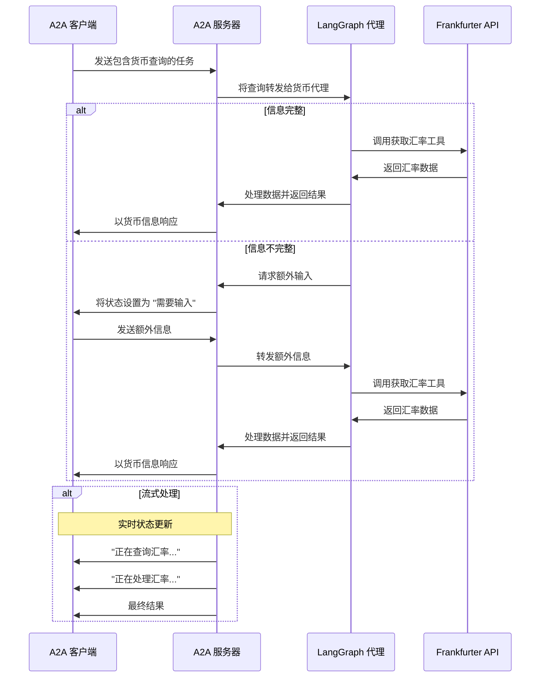

# 使用 A2A 协议的 LangGraph 货币代理

此示例展示了一个使用 [LangGraph](https://langchain-ai.github.io/langgraph/) 构建并通过 A2A 协议公开的货币转换代理。它展示了支持多轮对话和流式响应的对话交互。

## 工作原理

该代理使用 LangGraph 和大语言模型（例如 Google Gemini..），通过 ReAct 代理模式提供货币兑换信息。A2A 协议支持与代理进行标准化交互，允许客户端发送请求并接收实时更新。



## 主要特性

- **多轮对话**：代理在需要时可以请求额外信息
- **实时流式处理**：在处理过程中提供状态更新
- **推送通知**：支持基于 Webhook 的通知
- **对话记忆**：在交互过程中保持上下文
- **货币兑换工具**：集成 Frankfurter API 以获取实时汇率

## 前提条件

- Python 3.12 或更高版本
- [UV](https://docs.astral.sh/uv/)
- 访问大语言模型和 API 密钥

## 设置与运行

1. 导航到示例目录：

   ```bash
   cd samples/python/agents/langgraph
   ```

2. 创建一个包含 API 密钥的环境文件：

   ```bash
   如果你使用的是 Google Gemini 模型（gemini-pro 等）：
   echo "GOOGLE_API_KEY=your_api_key_here" > .env
  
   
   如果你使用的是 OpenAI 或任何兼容的 API（例如，通过 Ollama、LM Studio 等使用本地大语言模型）：

   echo "API_KEY=your_api_key_here" > .env （如果没有 API 密钥则不是必需的）
   echo "TOOL_LLM_URL=your_llm_url" > .env
   echo "TOOL_LLM_NAME=your_llm_name" > .env

   ```

3. 运行代理：

   ```bash
   # 在默认端口 10000 上基本运行
   uv run app

   # 在自定义主机/端口上运行
   uv run app --host 0.0.0.0 --port 8080
   ```

4. 在另一个终端中，运行测试客户端：

   ```bash
   uv run app/test_client.py
   ```

## 构建容器镜像

也可以使用容器文件来构建代理。

1. 导航到 `samples/python/agents/langgraph` 目录：

  ```bash
  cd samples/python/agents/langgraph
  ```

2. 构建容器文件

    ```bash
    podman build . -t langgraph-a2a-server
    ```

> [!提示]  
> Podman 是 `docker` 的直接替代品，这些命令中也可以使用它。

3. 运行容器

    ```bash
    podman run -p 10000:10000 -e GOOGLE_API_KEY=your_api_key_here langgraph-a2a-server
    ```

4. 运行 A2A 客户端（遵循上述部分的步骤 5）

> [!重要]
> * **访问 URL**：你必须通过 URL `0.0.0.0:10000` 访问 A2A 客户端。使用 `localhost` 将不起作用。
> * **主机名覆盖**：如果你要部署到容器外部主机名定义不同的环境中，请使用 `HOST_OVERRIDE` 环境变量在代理卡片上设置预期的主机名。这可确保与你的客户端应用程序进行正常通信。

## 技术实现

- **LangGraph ReAct 代理**：使用 ReAct 模式进行推理和工具使用
- **流式支持**：在处理过程中提供增量更新
- **检查点记忆**：在各轮对话之间保持对话状态
- **推送通知系统**：基于 Webhook 的更新，带有 JWK 身份验证
- **A2A 协议集成**：完全符合 A2A 规范

## 局限性

- 仅支持基于文本的输入/输出（不支持多模态）
- 使用的 Frankfurter API 货币选项有限
- 记忆基于会话，服务器重启后不会保留

## 示例

### 同步请求

请求：

```
POST http://localhost:10000
Content-Type: application/json

{
  "jsonrpc": "2.0",
  "id": 11,
  "method": "tasks/send",
  "params": {
    "id": "129",
    "sessionId": "8f01f3d172cd4396a0e535ae8aec6687",
    "acceptedOutputModes": [
      "text"
    ],
    "message": {
      "role": "user",
      "parts": [
        {
          "type": "text",
          "text": "1 美元兑换印度卢比的汇率是多少？"
        }
      ]
    }
  }
}
```

响应：

```
{
  "jsonrpc": "2.0",
  "id": 11,
  "result": {
    "id": "129",
    "status": {
      "state": "completed",
      "timestamp": "2025-04-02T16:53:29.301828"
    },
    "artifacts": [
      {
        "parts": [
          {
            "type": "text",
            "text": "1 美元兑换印度卢比的汇率是 85.49。"
          }
        ],
        "index": 0
      }
    ],
    "history": []
  }
}
```

### 多轮示例

请求 - 序列 1：

```
POST http://localhost:10000
Content-Type: application/json

{
  "jsonrpc": "2.0",
  "id": 10,
  "method": "tasks/send",
  "params": {
    "id": "130",
    "sessionId": "a9bb617f2cd94bd585da0f88ce2ddba2",
    "acceptedOutputModes": [
      "text"
    ],
    "message": {
      "role": "user",
      "parts": [
        {
          "type": "text",
          "text": "1 美元的汇率是多少？"
        }
      ]
    }
  }
}
```

响应 - 序列 2：

```
{
  "jsonrpc": "2.0",
  "id": 10,
  "result": {
    "id": "130",
    "status": {
      "state": "input-required",
      "message": {
        "role": "agent",
        "parts": [
          {
            "type": "text",
            "text": "你想兑换成哪种货币？另外，你想要最新汇率还是特定日期的汇率？"
          }
        ]
      },
      "timestamp": "2025-04-02T16:57:02.336787"
    },
    "history": []
  }
}
```

请求 - 序列 3：

```
POST http://localhost:10000
Content-Type: application/json

{
  "jsonrpc": "2.0",
  "id": 10,
  "method": "tasks/send",
  "params": {
    "id": "130",
    "sessionId": "a9bb617f2cd94bd585da0f88ce2ddba2",
    "acceptedOutputModes": [
      "text"
    ],
    "message": {
      "role": "user",
      "parts": [
        {
          "type": "text",
          "text": "加元"
        }
      ]
    }
  }
}
```

响应 - 序列 4：

```
{
  "jsonrpc": "2.0",
  "id": 10,
  "result": {
    "id": "130",
    "status": {
      "state": "completed",
      "timestamp": "2025-04-02T16:57:40.033328"
    },
    "artifacts": [
      {
        "parts": [
          {
            "type": "text",
            "text": "当前汇率是 1 美元 = 1.4328 加元。"
          }
        ],
        "index": 0
      }
    ],
    "history": []
  }
}
```

### 流式示例

请求：

```
{
  "id": "75",
  "jsonrpc": "2.0",
  "method": "message/send",
  "params": {
    "message": {
      "kind": "message",
      "messageId": "abc75",
      "parts": [
        {
          "kind": "text",
          "text": "75 美元兑换英镑是多少？"
        }
      ],
      "role": "user"
    }
  }
}
```

响应：

```json
data: {"jsonrpc":"2.0","id":12,"result":{"id":"131","status":{"state":"working","message":{"role":"agent","parts":[{"type":"text","text":"正在查询汇率..."}]},"timestamp":"2025-04-02T16:59:34.578939"},"final":false}}

data: {"jsonrpc":"2.0","id":12,"result":{"id":"131","status":{"state":"working","message":{"role":"agent","parts":[{"type":"text","text":"正在处理汇率.."}]},"timestamp":"2025-04-02T16:59:34.737052"},"final":false}}

data: {"jsonrpc":"2.0","id":12,"result":{"id":"131","artifact":{"parts":[{"type":"text","text":"根据当前汇率，1 美元相当于 0.77252 英镑。因此，100 美元大约是 77.252 英镑。"}],"index":0,"append":false}}}

data: {"jsonrpc":"2.0","id":12,"result":{"id":"131","status":{"state":"completed","timestamp":"2025-04-02T16:59:35.331844"},"final":true}}
```

## 了解更多

- [A2A 协议文档](https://google-a2a.github.io/A2A/)
- [LangGraph 文档](https://langchain-ai.github.io/langgraph/)
- [Frankfurter API](https://www.frankfurter.app/docs/)
- [Google Gemini API](https://ai.google.dev/gemini-api)